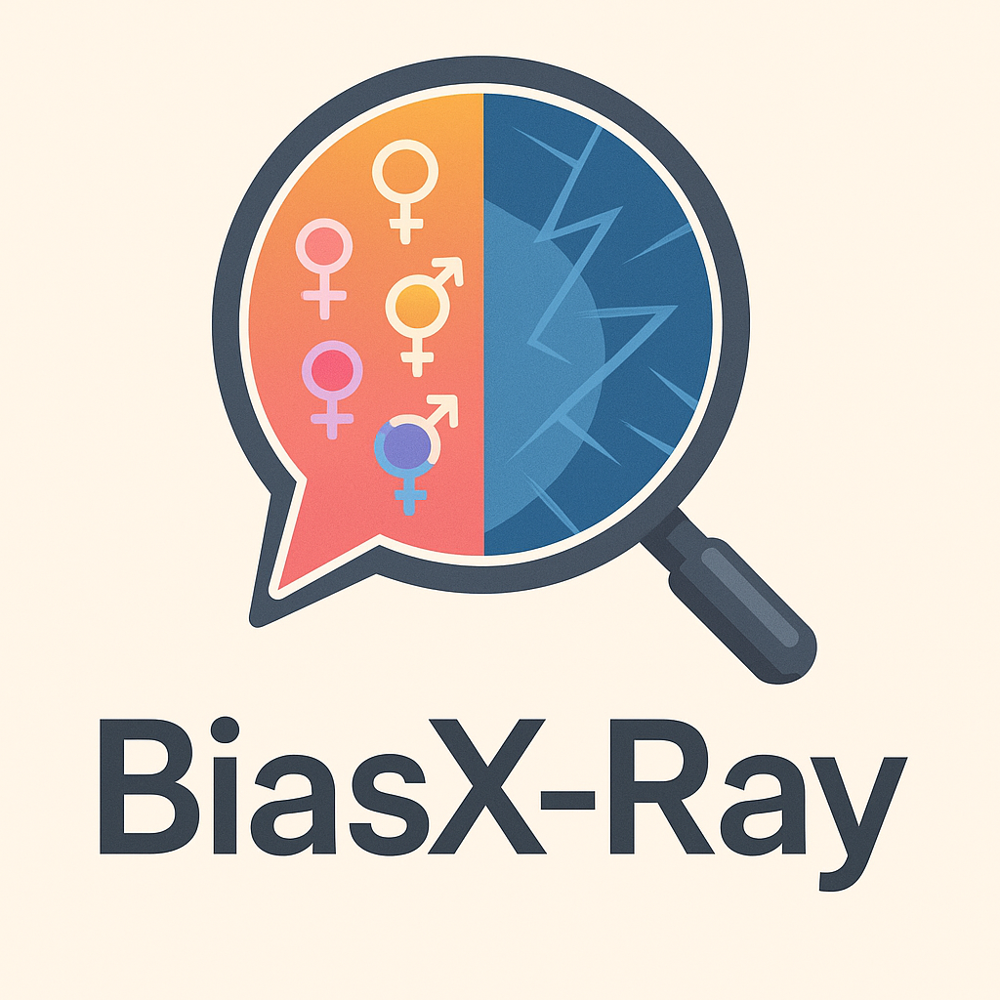

# BiasX

BiasX is a real-time gender bias analyzer that helps users create more inclusive and equitable communication. It analyzes text for various forms of gender bias and provides suggestions for more inclusive language.



## Features

- **Real-time Analysis**: Get instant feedback as you type
- **Professional Title Analysis**: Identifies gendered professional titles and suggests neutral alternatives
- **Gender-Coded Language Detection**: Recognizes masculine and feminine-coded words
- **Inclusive Language Suggestions**: Provides alternatives for gendered pronouns and relationship terms
- **Microaggression Detection**: Identifies potential microaggressions in communication
- **Tone Analysis**: Analyzes the overall tone of the text
- **Modern, Responsive UI**: Works seamlessly across desktop and mobile devices

## Getting Started

### Prerequisites

- Python 3.8+
- pip (Python package installer)

### Installation

1. Clone the repository:
```bash
git clone [your-repository-url]
cd BiasX
```

2. Create and activate a virtual environment (recommended):
```bash
python -m venv venv
# On Windows:
venv\Scripts\activate
# On macOS/Linux:
source venv/bin/activate
```

3. Install dependencies:
```bash
pip install -r requirements.txt
```

### Running the Application

1. Start the Flask server:
```bash
python app.py
```

2. Open your browser and navigate to:
```
http://localhost:5000
```

## Project Structure

```
BiasX/
├── app.py                 # Flask application main entry point
├── bias_detector.py       # Core bias detection logic
├── requirements.txt       # Python dependencies
├── static/               # Static files
│   ├── analyzer.html     # Analysis page
│   ├── analyzer.js       # Frontend analysis logic
│   ├── index.html       # Landing page
│   ├── styles.css       # Styling
│   └── ...
└── README.md            # This file
```

## Technology Stack

- **Backend**: Python, Flask
- **Frontend**: HTML5, CSS3, JavaScript
- **Machine Learning**: scikit-learn, NumPy
- **Deployment**: Gunicorn (WSGI HTTP Server)

## Features in Detail

### Professional Titles
Detects gendered professional titles (e.g., "chairman", "policeman") and suggests gender-neutral alternatives (e.g., "chairperson", "police officer").

### Gender-Coded Language
Identifies words that are traditionally associated with masculine or feminine traits and suggests more neutral alternatives.

### Inclusive Language
Provides suggestions for:
- Gender-neutral pronouns
- Inclusive relationship terms
- Professional title alternatives

### Microaggression Detection
Identifies subtle forms of gender bias and microaggressions in communication, helping users create more inclusive content.

## Contributing

Contributions are welcome! Please feel free to submit a Pull Request.

## License

This project is licensed under the MIT License - see the LICENSE file for details.

## Author

Developed by Mayank Bansal